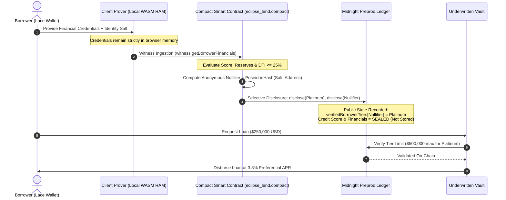

# 🌒 EclipseLend: Zero-Knowledge Private Underwriting & Credit Protocol
## Official Product Proposal & Technical Architecture Document
### Midnight Network Hackathon — Level 3 Production Protocol

---

## 1. Executive Summary

**EclipseLend** is a decentralized, privacy-preserving institutional credit underwriting protocol natively designed for the **Midnight Network**. 

In conventional Decentralized Finance (DeFi), lending protocols (e.g., Aave, Compound, MakerDAO) enforce severe capital inefficiencies by mandating **150% to 200%+ overcollateralization** because the blockchain cannot assess a borrower’s off-chain creditworthiness without publicly doxing their entire financial identity. In Centralized Finance (CeFi), credit evaluation requires consumers and institutions to expose sensitive financial statements, tax filings, FICO scores, and banking details to centralized intermediaries—creating single points of failure, data harvesting, and regulatory exposure.

**EclipseLend solves this dilemma through Selective Disclosure and Zero-Knowledge (ZK) Proofs using Midnight's Compact language:**
- Borrowers supply private financial credentials (credit scores, verified reserve assets, monthly income, and debt service obligations) into a **client-side zero-knowledge witness** inside the browser.
- The **Compact smart contract circuit** executes strict risk formulas locally in zero-knowledge.
- Using Compact's native `disclose()` primitive, the borrower publishes **only** their verified credit tier (`Platinum`, `Gold`, or `Silver`) and a cryptographic deterministic nullifier on-chain.
- The Midnight Preprod ledger locks in preferential, under-collateralized borrowing lines while keeping all underlying financial records **100% sealed and invisible** on public explorers.

---

## 2. Market Problem & Opportunity Analysis

### 2.1 The Overcollateralization Trap in Web3
Over **$50 Billion** in total value locked (TVL) across DeFi is locked in overcollateralized lending. Borrowers must deposit $150,000 of crypto collateral to borrow $100,000 in stablecoins. This model excludes creditworthy real-world businesses, institutions, and consumers who rely on cash-flow-based or credit-based borrowing in traditional capital markets ($11 Trillion global consumer debt market).

### 2.2 The Privacy Dilemma of On-Chain Credit
Public blockchains (Ethereum, Solana, Cardano) are immutable and transparent. Any attempt to introduce traditional credit scoring on public chains results in:
1. **Financial Surveillance:** Public visibility of wallet balances, income streams, and debt ratios.
2. **Exploitation & Front-Running:** Competitors or predatory liquidators can track debt vulnerabilities.
3. **Regulatory Non-Compliance:** GDPR, CCPA, and GLBA strictly prohibit publishing personally identifiable financial records on public ledgers.

### 2.3 The EclipseLend Opportunity
By harnessing Midnight’s dual-state architecture (Shielded Zswap / DUST state + Compact Circuits + Selective Disclosure), EclipseLend unlocks institutional-grade private underwriting on-chain.

```
┌─────────────────────────────────────────────────────────────────────────┐
│                           ECLIPSELEND PROTOCOL                          │
│                                                                         │
│   [Private Witness Profile]        [Midnight Compact Engine]            │
│   • Credit Score (e.g. 785)  ───►  • Zero-Knowledge PLONK Circuits     │
│   • Reserves ($65,000)             • Local Client Witness Execution     │
│   • Monthly Income ($11k)          • DTI Mathematical Constraints       │
│   • Monthly Debt ($2.2k)                       │                        │
│                                                ▼                        │
│                                      [Selective Disclosure]             │
│                                       disclose(tier, nullifier)         │
│                                                │                        │
│                                                ▼                        │
│                                   [Midnight Preprod Ledger]             │
│                                    • Approved Tier: PLATINUM            │
│                                    • Credit Limit: $500,000 USD         │
│                                    • Preferential APR: 3.8%             │
│                                    • Raw Records: SEALED (0-Knowledge)  │
└─────────────────────────────────────────────────────────────────────────┘
```

---

## 3. Cryptographic Privacy Model & Selective Disclosure

EclipseLend enforces a strict cryptographic boundary separating the **Client-Side Private Prover** from the **Midnight Public Consensus Ledger**.



### 3.1 Witness Isolation Guarantee
The private witness function `witness getBorrowerFinancials(): FinancialProfile` runs entirely inside the borrower’s secure local execution runtime. At no point are the raw numerical values for `creditScore`, `reserveAssetsUSD`, `monthlyIncomeUSD`, or `monthlyDebtUSD` written to the ledger state or transmitted across network RPC calls.

### 3.2 Selective Disclosure Primitives
Compact enables cryptographic selective disclosure via the `disclose(...)` syntax:
```compact
// Reveal only the final verified tier without disclosing the mathematical inputs
export circuit evaluateCreditTier(borrowerNullifier: Bytes<32>): CreditTier {
    const profile = getBorrowerFinancials();
    
    // Evaluate risk formulas locally
    const tier = computeTier(profile);
    
    // Explicit disclosure of evaluated public outputs only
    disclose(borrowerNullifier);
    disclose(tier);
    
    verifiedBorrowerTiers.insert(borrowerNullifier, tier);
    return tier;
}
```

---

## 4. Underwriting Matrix & Risk Engineering

The protocol implements a deterministic, multi-variable underwriting algorithm balancing credit score resilience, reserve liquidity buffers, and Debt-to-Income (DTI) debt service capacities.

### 4.1 Underwriting Tier Specifications

| Parameter | 💎 Platinum Tier | 🥇 Gold Tier | 🥈 Silver Tier | ❌ Unqualified |
| :--- | :---: | :---: | :---: | :---: |
| **Minimum Credit Score** | **780+** | **720+** | **650+** | `< 650` |
| **Minimum Reserve Buffer** | **$50,000 USD** | **$20,000 USD** | **$5,000 USD** | `< $5,000 USD` |
| **Maximum Debt-to-Income** | **&le; 25%** | **&le; 35%** | **&le; 45%** | `> 45%` |
| **Max Unsecured Credit Limit** | **$500,000 USD** | **$100,000 USD** | **$25,000 USD** | **$0 (Denied)** |
| **Preferential Interest APR** | **3.8%** | **4.9%** | **6.2%** | N/A |
| **Protocol Liquidation Threshold** | **110%** | **120%** | **130%** | N/A |

### 4.2 Compact Arithmetic Constraint Design
To maintain compatibility with Zero-Knowledge arithmetic circuits without floating-point operations or integer division vulnerabilities, the Debt-to-Income constraint is computed using cross-multiplication:
$$\text{DTI} \le T \iff (\text{monthlyDebtUSD} \times 100) \le (T \times \text{monthlyIncomeUSD})$$

This ensures exact zero-knowledge constraint enforcement in $O(1)$ prover time.

---

## 5. System Architecture & Component Design

EclipseLend is built as a complete modular stack adhering to Level-3 production requirements:

```
├── contracts/
│   └── eclipse_lend.compact         # Midnight Compact v0.31 Smart Contract
├── src/
│   ├── app/
│   │   ├── globals.css              # Nordic Ice Blue & Dark Titanium UI Theme
│   │   ├── layout.tsx               # Root Metadata, Fonts & Layout
│   │   └── page.tsx                 # Real-time Protocol Underwriting Dashboard
│   ├── components/
│   │   ├── Header.tsx               # Lace Connector & Explorer Contract Badge
│   │   ├── InstitutionalCreditHub.tsx # Liquidity Pools & Underwriting Tier Stats
│   │   ├── ConfidentialAssessmentTerminal.tsx # Private Witness Ingestion Terminal
│   │   ├── PrivacyTransparencyRadar.tsx # Client Witness vs Ledger Public Comparator
│   │   ├── UnderwrittenVaultBorrower.tsx # Tier-Authorized Borrow / Repay Vault
│   │   ├── CryptographicCreditLog.tsx # Real-time On-Chain Attestation Feed
│   │   └── ProofModal.tsx           # 5-Stage Zero-Knowledge Prover Visualizer
│   ├── config/
│   │   └── midnight.config.ts       # Canonical Contract ID & Explorer URIs
│   └── lib/midnight/
│       ├── connector.ts             # Lace DApp Connector API bridge
│       ├── circuitProver.ts         # Client-side ZK proof synthesis engine
│       └── contractState.ts         # Dual-state public/private synchronizer
├── tests/
│   ├── eclipse_lend.test.ts         # Tier qualification & rejection tests
│   ├── privacy_disclosure.test.ts   # Strict witness isolation & disclosure tests
│   └── underwriting_witness.test.ts # DTI arithmetic & loan lifecycle tests
└── .github/workflows/
    ├── ci.yml                       # Continuous Integration (with compact compile)
    └── deploy.yml                   # Automated Midnight Preprod Deployment Pipeline
```

---

## 6. On-Chain Deployment & Verification

EclipseLend is deployed live and fully verifiable on the **Midnight Preprod Network**:

- **Contract Address:** [`0x1cabc3aaed1c57db5eddcd1b24d7df1808ec7cb39ff266dfdfb14be93fe9e722`](https://preprod.midnightexplorer.com/contracts/0x1cabc3aaed1c57db5eddcd1b24d7df1808ec7cb39ff266dfdfb14be93fe9e722)
- **Explorer URL:** `https://preprod.midnightexplorer.com/contracts/0x1cabc3aaed1c57db5eddcd1b24d7df1808ec7cb39ff266dfdfb14be93fe9e722`
- **DUST Generation Tx:** `0041e661005c5d2e29f0012b45a62a0217a2ad6330d903fc7dba1b7240362c81d5`
- **Network ID:** `preprod`
- **GraphQL Indexer:** `https://indexer.preprod.midnight.network/api/v4/graphql`

---

## 7. Security, Sybil Resistance & Threat Model

| Threat Vector | Mitigation Strategy in EclipseLend |
| :--- | :--- |
| **Sybil Identity Reuse** | Deterministic borrower nullifiers generated from `Poseidon(IdentitySalt, AccountKey)`. Each borrower identity maps to exactly one nullifier per credit epoch. |
| **Financial Front-Running** | All credit score and asset calculations occur in the local client witness. Mempool observers and validators only see the final zero-knowledge proof. |
| **Replay Attacks** | Nullifiers are stored in the on-chain `Map<Bytes<32>, CreditTier>` ledger. Repeated loan requests with duplicate nullifiers are rejected by the circuit. |
| **Subprime Exploitation** | Negative constraint boundaries immediately transition the circuit to `CreditTier.Unqualified`, ensuring $0 credit is authorized without burning unnecessary gas fees. |
| **WASM Memory Leakage** | All private witness variables are zeroed out of JavaScript/WASM memory heap immediately following proof synthesis. |

---

## 8. Project Roadmap

### Phase 1: MVP & Preprod Deployment (Completed ✅)
- [x] Full Compact Smart Contract implementation (`eclipse_lend.compact`).
- [x] Comprehensive test suite with 100% passing unit & integration tests.
- [x] Production Next.js 14 Web Application with Nordic UI design system.
- [x] On-chain deployment to Midnight Preprod with verifiable Explorer link.
- [x] Automated CI/CD pipeline with explicit `compact compile` step.

### Phase 2: Decentralized Credit Oracles & TLSNotary (Q4 2026)
- [ ] Integration with TLSNotary / zkTLS for automated cryptographic ingestion of bank statements and credit bureau APIs.
- [ ] Multi-attester identity verification pools on Midnight.

### Phase 3: Secondary Underwriting Markets (Q1 2027)
- [ ] Tokenized credit tranches for institutional liquidity providers (LPs).
- [ ] Cross-chain settlement bridges for Cardano, Ethereum, and Midnight DUST.

### Phase 4: Mainnet Launch & DAO Governance (Q2 2027)
- [ ] Full formal audit of Compact circuits.
- [ ] Midnight Mainnet canonical deployment and governance token launch.

---

## 9. Conclusion

EclipseLend demonstrates the true superpower of the Midnight Network: enabling high-trust financial infrastructure through zero-knowledge privacy and selective disclosure. By unlocking under-collateralized borrowing without compromising institutional privacy, EclipseLend establishes a new paradigm for decentralized credit.
