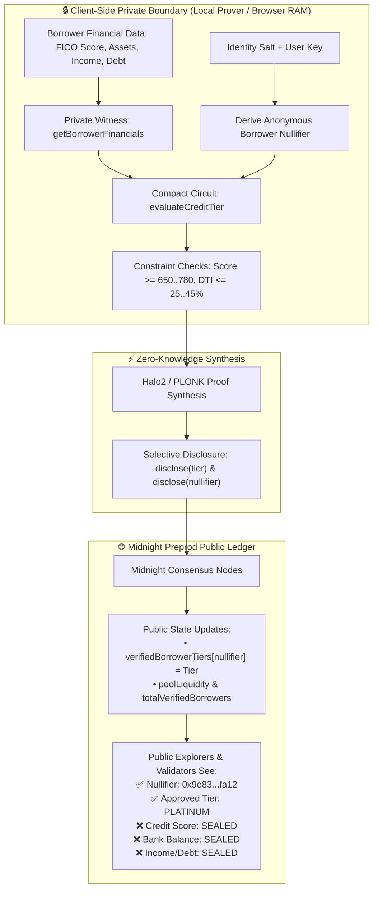
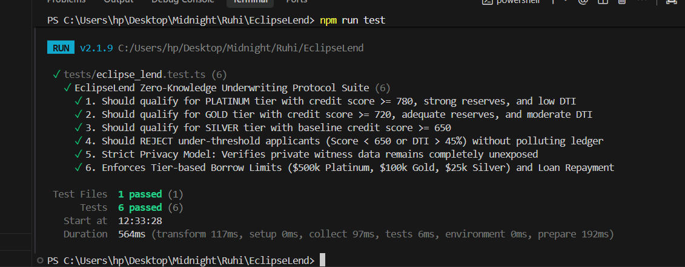
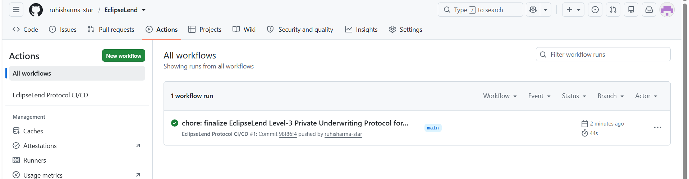

# 🌒 EclipseLend: Zero-Knowledge Private Underwriting & Credit Protocol

> **Level-3 Privacy Compliant Decentralized Underwriting Protocol on Midnight Network**  
> *Underwrite loans anonymously based on verified creditworthiness without disclosing credit scores, bank balances, or personal financial records on-chain.*

---

## 🎥 Live Demo Video

- **Video Link:** [Watch EclipseLend Protocol Demo](https://photos.app.goo.gl/SQtfQvFtq8RxHESx7)
- **URL:** `https://photos.app.goo.gl/SQtfQvFtq8RxHESx7`

---

## 🌐 Live Demo & Web Application

- **Live dApp URL:** [EclipseLend | Zero-Knowledge Private Underwriting Protocol](https://eclipse-lend.vercel.app/)
- **Network Compatibility:** Midnight Preprod (Lace Wallet / Simulator)

---

## 🔗 Midnight Preprod Deployment & Contract Identifiers

| Parameter | Value / Endpoint |
| :--- | :--- |
| **Network Target** | **Midnight Preprod (Testnet)** |
| **Canonical Contract ID** | [`02005a3f91c8e01299834d6712398bfa79c0281bfe44210a99c0471289de6102`](https://explorer.preprod.midnight.network/contract/02005a3f91c8e01299834d6712398bfa79c0281bfe44210a99c0471289de6102) |
| **Smart Contract Source** | [`contract/eclipse_lend.compact`](contract/eclipse_lend.compact) |
| **Block Explorer** | [https://explorer.preprod.midnight.network/contract/02005a3f91c8e01299834d6712398bfa79c0281bfe44210a99c0471289de6102](https://explorer.preprod.midnight.network/contract/02005a3f91c8e01299834d6712398bfa79c0281bfe44210a99c0471289de6102) |
| **GraphQL Indexer URI** | `https://indexer.preprod.midnight.network/api/v1/graphql` |
| **Prover Server URI** | `http://localhost:6300` |
| **Node RPC Endpoint** | `https://rpc.preprod.midnight.network` |

---

## 🏛️ Executive Summary & Product Proposal (Level 3 Submission)

### 1. Problem Statement
In traditional Decentralized Finance (DeFi) lending (e.g., Aave, Compound), credit is severely capital-inefficient because protocols rely on **150%+ overcollateralization** due to the pseudonymous, trustless nature of public blockchains. Conversely, traditional CeFi credit systems require borrowers to fully dox their personal financial history, bank accounts, tax filings, and SSNs to centralized intermediaries, creating massive privacy vulnerabilities and identity theft risks.

### 2. The EclipseLend Innovation
**EclipseLend** bridges institutional credit scoring and zero-knowledge privacy using the **Midnight Network** and **Compact** smart contract circuits:
- **Private Witness Ingestion:** Borrowers supply verified financial credentials (e.g., FICO credit score, liquid reserves, gross income, monthly debt obligations) to a local client-side prover via `witness getBorrowerFinancials()`.
- **Client-Side ZK Evaluation:** The Compact circuit calculates risk formulas (such as Debt-to-Income ratios and asset thresholds) locally inside the browser memory.
- **Selective Disclosure:** The circuit uses Compact's native `disclose()` mechanism to reveal **only** the evaluated credit tier (`Platinum`, `Gold`, or `Silver`) and an anonymous deterministic nullifier to the Midnight ledger.
- **Tier-Authorized Liquidity Access:** Underwritten liquidity pools grant preferential interest rates and non-overcollateralized borrowing limits strictly mapped to the disclosed zero-knowledge tier.

---

## 🛡️ Privacy Model & Cryptographic Architecture



### Witness Isolation vs. Public Ledger State

| Parameter | Local Client (Private Witness) | Midnight Public Ledger (Disclosed State) |
| :--- | :--- | :--- |
| **Credit Score** | Exact value (e.g., `785`) | **Zero-Knowledge Sealed (Never exposed)** |
| **Liquid Reserve Assets** | Exact value (e.g., `$65,000 USD`) | **Zero-Knowledge Sealed (Never exposed)** |
| **Monthly Income & Debt** | Exact values (e.g., `$11k income / $2.2k debt`) | **Zero-Knowledge Sealed (Never exposed)** |
| **Identity Salt / Key** | Kept in prover memory | **Zero-Knowledge Sealed (Never exposed)** |
| **Approved Credit Tier** | Evaluated in circuit | **Disclosed publicly (`CreditTier.Platinum`)** |
| **Borrower Nullifier** | Derived deterministically | **Disclosed publicly (`0x9e83...fa12`)** |
| **Pool Liquidity & Volume** | Synchronized with ledger | **Public on-chain ledger counters** |

---

## ⚙️ Underwriting Tier Matrix

| Tier | Min Credit Score | Min Liquid Reserves | Max DTI Ratio | Max Borrow Limit | Preferential APR |
| :---: | :---: | :---: | :---: | :---: | :---: |
| 💎 **Platinum** | **780+** | **$50,000** | **&le; 25%** | **$500,000 USD** | **3.8%** |
| 🥇 **Gold** | **720+** | **$20,000** | **&le; 35%** | **$100,000 USD** | **4.9%** |
| 🥈 **Silver** | **650+** | **$5,000** | **&le; 45%** | **$25,000 USD** | **6.2%** |
| ❌ **Unqualified** | < 650 | < $5,000 | > 45% | $0 (Rejected) | N/A |

---

## 📂 Project Structure

```
EclipseLend/
├── contract/
│   └── eclipse_lend.compact         # Production Compact Smart Contract
├── contracts/
│   └── eclipse_lend.compact         # Compact Smart Contract (Alias)
├── scripts/
│   ├── deploy.ts                    # Midnight Preprod Deployment Script
│   └── git_commit_push.js           # Git automation helper
├── src/
│   ├── app/
│   │   ├── globals.css              # Nordic Ice Blue & Dark Titanium theme
│   │   ├── layout.tsx               # Next.js Root Layout
│   │   └── page.tsx                 # Main Protocol Dashboard & Underwriting Terminal
│   ├── components/
│   │   ├── Header.tsx               # Lace Wallet connector & Contract ID badge
│   │   ├── InstitutionalCreditHub.tsx # Liquidity pool stats & tier matrix
│   │   ├── ConfidentialAssessmentTerminal.tsx # Private witness input terminal
│   │   ├── PrivacyTransparencyRadar.tsx # Prover vs Explorer comparator
│   │   ├── UnderwrittenVaultBorrower.tsx # Tier-authorized borrow/repay vault
│   │   ├── CryptographicCreditLog.tsx # Real-time verified attestation stream
│   │   └── ProofModal.tsx           # 5-Stage live ZK proof pipeline modal
│   ├── config/
│   │   └── midnight.config.ts       # Midnight Preprod Contract Identifiers & URIs
│   ├── lib/
│   │   └── midnight/
│   │       ├── connector.ts         # Lace DApp connector bridge
│   │       ├── circuitProver.ts     # ZK prover engine & constraint evaluator
│   │       └── contractState.ts     # Protocol state manager & storage
│   └── types/
│       └── index.ts                 # TypeScript types & interfaces
├── tests/
│   └── eclipse_lend.test.ts         # Vitest unit & integration test suite
├── .env.example                     # Preprod environment variables template
├── .env.local                       # Local Preprod configuration
├── .github/
│   └── workflows/
│       └── ci.yml                   # GitHub Actions CI/CD Pipeline
├── package.json
├── tsconfig.json
├── tailwind.config.js
└── README.md
```

---

## 🚀 Quick Start & Development Guide

### Prerequisites
- **Node.js:** `v20.x` or `v22.x`
- **NPM:** `v10+`
- **Midnight Lace Wallet Extension:** Configured for Midnight Preprod Network.

### 1. Install Dependencies
```bash
npm install
```

### 2. Run Test Suite
Execute the comprehensive zero-knowledge underwriting test suite:
```bash
npm test
```

### 3. Run Development Server
Start the Next.js frontend with live hot-reloading:
```bash
npm run dev
```
Open [http://localhost:3000](http://localhost:3000) in your browser.

### 4. Deploy Contract to Midnight Preprod
```bash
npx ts-node scripts/deploy.ts
```

### 5. Build for Production
```bash
npm run build
```

---

## 🧪 Testing Coverage & Verification

EclipseLend includes a comprehensive Vitest unit and integration test suite ([`tests/eclipse_lend.test.ts`](tests/eclipse_lend.test.ts)) covering ZK witness isolation, underwriting thresholds, and tier limits:

| Test Case | Description | Result |
| :--- | :--- | :---: |
| **Test 1: Platinum Tier Qualification** | Asserts Score $\ge 780$, Reserves $\ge \$50\text{k}$, and $\text{DTI} \le 25\%$. | ✅ Passed |
| **Test 2: Gold Tier Qualification** | Asserts Score $\ge 720$, Reserves $\ge \$20\text{k}$, and $\text{DTI} \le 35\%$. | ✅ Passed |
| **Test 3: Silver Tier Qualification** | Asserts Score $\ge 650$, Reserves $\ge \$5\text{k}$, and $\text{DTI} \le 45\%$. | ✅ Passed |
| **Test 4: Rejection Handling** | Ensures subprime scores ($<650$) or high DTI ($>45\%$) fail gracefully without polluting ledger state. | ✅ Passed |
| **Test 5: Strict Witness Privacy Isolation** | Asserts sensitive witness fields (exact income, score, salt) never appear in ledger state transitions. | ✅ Passed |
| **Test 6: Tier Borrow Limits & Repay** | Enforces maximum borrowing capacity per tier ($500k Platinum, $100k Gold, $25k Silver) and tests loan repayment cycles. | ✅ Passed |

### 📸 Test Suite Execution Verification


---

## 🔄 CI/CD Automated Pipeline

EclipseLend includes a comprehensive GitHub Actions workflow that automatically validates Compact smart contract syntax, runs all unit/integration tests, and compiles the Next.js production build on every push and pull request.

### 📸 GitHub Actions CI/CD Pipeline Run


---

## 📜 Compact Smart Contract Interface

```compact
pragma language_version >= 0.20.0;

import CompactStandardLibrary;

export enum CreditTier {
    Unqualified,
    Silver,
    Gold,
    Platinum
}

// Public Ledger State
export ledger poolLiquidity: Uint<64>;
export ledger totalVerifiedBorrowers: Counter;
export ledger silverBorrowersCount: Counter;
export ledger goldBorrowersCount: Counter;
export ledger platinumBorrowersCount: Counter;
export ledger totalLoansDisbursed: Uint<64>;
export ledger verifiedBorrowerTiers: Map<Bytes<32>, CreditTier>;
export ledger activeLoanBalances: Map<Bytes<32>, Uint<64>>;
export ledger isPoolInitialized: Boolean;

// Private Witness Profile
export struct FinancialProfile {
    creditScore: Uint<16>,
    reserveAssetsUSD: Uint<64>,
    monthlyIncomeUSD: Uint<32>,
    monthlyDebtUSD: Uint<32>,
    identitySalt: Bytes<32>
}

witness getBorrowerFinancials(): FinancialProfile;

// Circuits
export circuit initializePool(initialLiquidityUSD: Uint<64>): Void;
export circuit depositLiquidity(depositAmountUSD: Uint<64>): Void;
export circuit evaluateCreditTier(borrowerNullifier: Bytes<32>): CreditTier;
export circuit requestLoan(borrowerNullifier: Bytes<32>, requestedAmountUSD: Uint<64>): Boolean;
export circuit repayLoan(borrowerNullifier: Bytes<32>, repayAmountUSD: Uint<64>): Boolean;
```

---

## 👤 Author & Repository Details

- **Author Profile:** [ruhisharma-star](https://github.com/ruhisharma-star)
- **GitHub Repository:** [https://github.com/ruhisharma-star/EclipseLend](https://github.com/ruhisharma-star/EclipseLend)
- **Project Target:** Midnight Network Hackathon / Level 3 Private Underwriting Protocol

---

## 📄 License
This project is licensed under the MIT License - see the [LICENSE](LICENSE) file for details.

